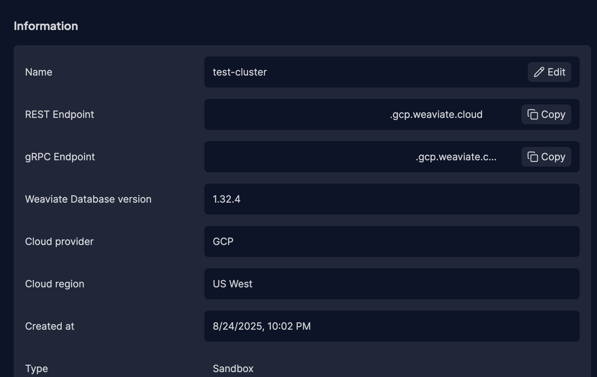
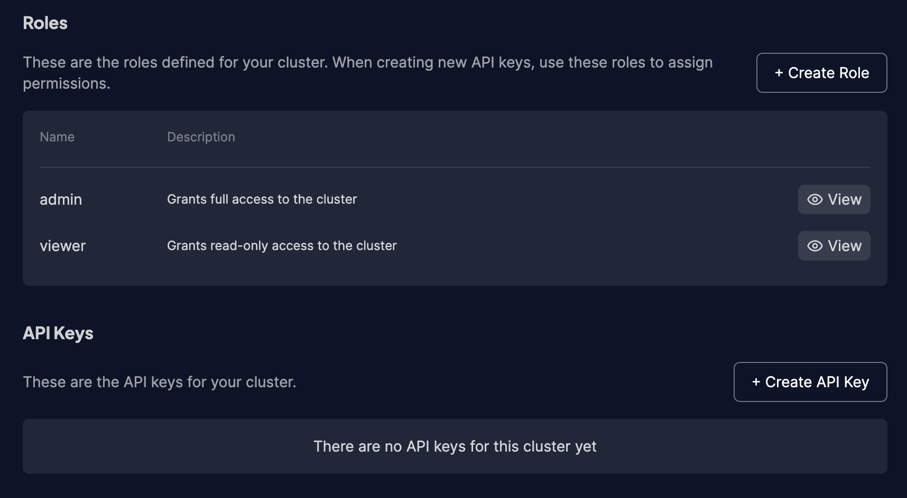
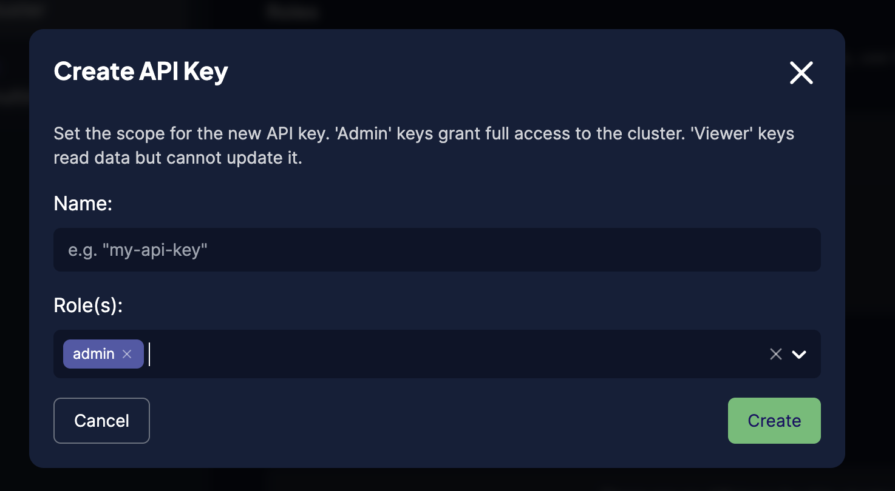

# Weaviate Workshop


## Create a Weaviate Cloud instance

  * Head to [Weaviate Cloud console](https://console.weaviate.cloud/) and log in, or create a new account.
  * Create a free `Sandbox` cluster. Give it a name, select the cloud region and press "Create".
  * Copy your REST endpointe and paste it into your .env as WEAVIATE_URL
  * Create an API key with admin privileges and copy and paste it into your .env as WEAVIATE _KEY







## Running the workshop

### Option 1 - Run locally

#### Virtual environment – do this only once 
First create a new venv configuration.
```
python3 -m venv .venv
```

Then switch to the new configuration:
```
source .venv/bin/activate
```

And install the required packages.
```
pip install -r requirements.txt
```

### Option 2 - GitHub CodeSpaces instructions

1. Go to the project [https://github.com/weaviate-tutorials/weaviate-workshop](https://github.com/weaviate-tutorials/weaviate-workshop)

Make sure you are logged in with GitHub.

2. Create a Codespace project
  * Press the green `<> Code` button, then switch to `Codespaces` tab.
  * Press the `Create codespace on main` button.
  * Your codespace project will install all the necessary components, it will take a few minutes.

### Option 3 - Run in Google Colab

1. Click on the Google Colab button at the top of the notebook in this repo.
2. Uncomment the first cell in the notebook to install the dependencies.
3. Paste your keys into the first cell in the Dependencies section of the notebook.


## Env vars

Update env vars in .env.

Hint. you can find your Weaviate Cluster URL and API keys in the [WCD console](https://console.weaviate.cloud/).

* WEAVIATE_URL - is the `REST Endpoint`
* WEAVIATE_KEY - is the `Admin` key in `API Keys`

